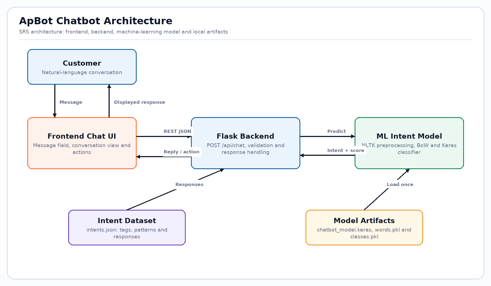
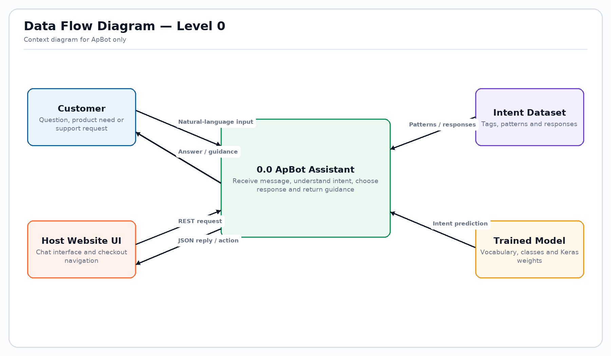
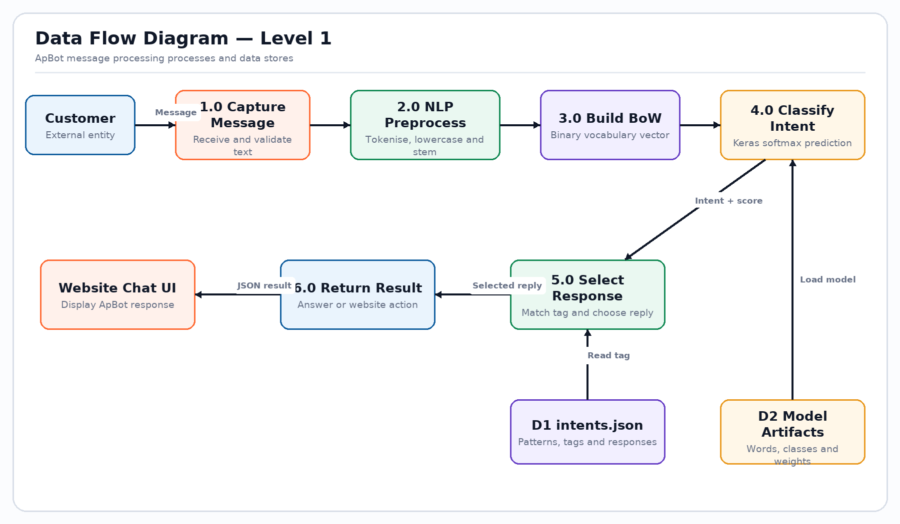
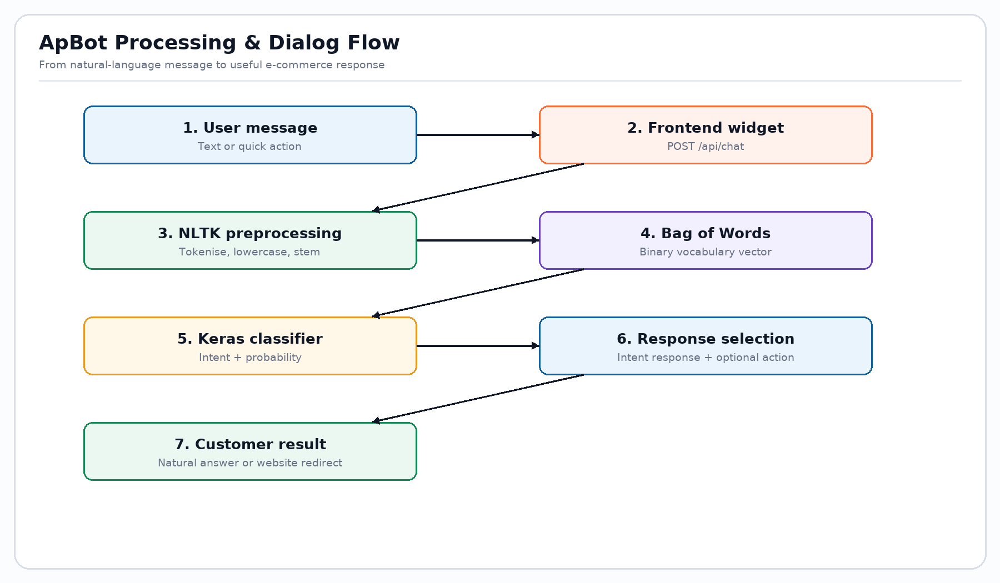

# ZiloCart with ApBot
## Complete Project, Recommendation Models, SRS Compliance and Integration Documentation

**Document version:** 3.0  
**Date:** 19 August 2026  
**Project theme:** E-Commerce Assistant — Unleashing the Power of AI/ML  
**Prepared from:** the supplied `srs.pdf` and the complete repository implementation  
**Project team:** Mohammad Hamza, Ibrahim Bawany, Usman Bawany and Yousuf

---

# Document Control

| Item | Details |
|---|---|
| Project | ZiloCart E-Commerce Product Recommendation System with ApBot |
| Primary AI component | ApBot intent-classification customer assistant |
| Host application | Flask/Jinja e-commerce website |
| Data platforms | Microsoft SQL Server; optional MongoDB activity log |
| ML families | Content-based KNN, user-user collaborative KNN, hybrid orchestration, trending fallback, neural intent classification |
| Reference baseline | ApBot Software Requirements Specification supplied as `srs.pdf` |
| Audience | Evaluators, stakeholders, developers, testers and maintainers |
| Status | Implementation-aligned complete project documentation |

## Revision History

| Version | Date | Summary |
|---|---|---|
| 1.0 | August 2026 | Initial ApBot project report |
| 2.0 | August 2026 | ApBot-focused SRS revision |
| 3.0 | 19 August 2026 | Recreated as complete ZiloCart documentation, including commerce modules, databases, all recommendation approaches, ApBot training and end-to-end integration |

## How to Read This Report

This report treats the supplied SRS as the mandatory baseline and the repository as the source of truth for the implemented system. Statements marked as implemented correspond to repository code or artifacts. Proposed production controls and recommended future work are identified separately so that planned capability is not confused with completed functionality.

---

# Table of Contents

1. Executive Summary  
2. Background, Problem Definition and Proposed Solution  
3. Purpose, Scope, Stakeholders, Assumptions and Constraints  
4. SRS Compliance and Requirements Traceability  
5. Complete Feature Inventory  
6. System Architecture and Deployment View  
7. Data Flow and Principal Workflows  
8. Database and Data Design  
9. Recommendation System — Data Pipeline  
10. Content-Based Recommendation Model  
11. Collaborative Filtering Model  
12. Hybrid, Personalisation and Fallback Strategy  
13. Recommendation Evaluation, Limitations and MLOps  
14. ApBot Dataset and Language Understanding  
15. ApBot Neural Model, Training and Inference  
16. ApBot REST and ZiloCart Integration  
17. Frontend and User Experience  
18. Commerce, Identity and Administration Modules  
19. Security, Privacy and Reliability  
20. Interfaces, Installation and Configuration  
21. Testing and Acceptance Plan  
22. Operations, Maintenance and Troubleshooting  
23. Risks, Known Limitations and Roadmap  
24. Website Working Screenshots and Evidence  
25. Deliverables, Repository Map and Conclusion  
Appendices: API contract, route catalogue, model artifacts, glossary and traceability summary

---

# 1. Executive Summary

ZiloCart is a full-stack e-commerce application with an embedded AI assistant called **ApBot** and several product-discovery strategies. Customers can create accounts, browse and filter a product catalogue, inspect product details, maintain a session cart, check out, review verified purchases and inspect their order history. Administrators can manage products, users, orders and reviews and can inspect sales and activity reports.

ApBot fulfils the supplied SRS requirement for an e-commerce assistant. It accepts ordinary text in a floating browser chat widget. NLTK tokenisation and Porter stemming transform the message into a binary Bag-of-Words vector. A TensorFlow/Keras neural network predicts one of 21 intent classes. The Flask backend enriches selected intents with live catalogue, sale, cart, account or latest-order information and returns a JSON response through `POST /api/chat`.

The recommendation subsystem supports four practical modes:

- **Content-based:** TF-IDF unigrams/bigrams over product name, category, brand and description; Truncated SVD; scaled rating and price; L2 normalisation; cosine KNN.
- **Collaborative:** a user-item matrix based on purchased quantity, enriched by review ratings, followed by cosine user-user KNN.
- **Personalised orchestration:** collaborative results plus content results inspired by the most recent viewed product, deduplicated and filled with trending items.
- **Cold-start/trending fallback:** SQL-derived popularity using ordered quantity, review volume, product rating and recency.

The application integrates Microsoft SQL Server for transactional commerce data and optionally MongoDB for behavioural activity. Saved model artifacts allow local inference. Graceful fallbacks keep product discovery operational when model files or MongoDB are unavailable.

## 1.1 Principal Outcome

The project goes beyond a stand-alone chatbot. It provides an integrated shopping system in which ApBot can guide discovery, display sale-aware product cards, describe the current customer's own cart and order state, and connect recommendation output to real product pages. The design preserves an important privacy boundary: ordinary chatbot requests never expose another customer's records or administrator-only information.

## 1.2 Technology Summary

| Layer | Implemented technology |
|---|---|
| Presentation | HTML5, CSS, JavaScript, Jinja templates |
| Application | Python, Flask 3.1.3 |
| Transactional data | Microsoft SQL Server via `pyodbc` |
| Activity data | Optional MongoDB via `pymongo` |
| Recommendation ML | pandas, NumPy, SciPy, scikit-learn |
| ApBot NLP/ML | NLTK, TensorFlow/Keras, NumPy |
| Training and analysis | Jupyter notebooks, Matplotlib, Seaborn |
| Authentication | Flask session, Werkzeug password hashing with legacy SHA-256 compatibility |

---

# 2. Background, Problem Definition and Proposed Solution

## 2.1 Background and Necessity

Online customers expect immediate support at every hour, but human support channels can be slow, costly and repetitive. Users also face choice overload: a large product catalogue makes it difficult to identify a suitable item, compare alternatives or understand current promotions. Static FAQ pages and simple keyword search do not adapt well to varied language, incomplete questions or individual behaviour.

The supplied SRS identifies the value of a conversational e-commerce assistant: continuous availability, fast answers, scalability, lower support load and better customer experience. ZiloCart adds recommendation models because assistance and product discovery are closely related. A customer who asks for a recommendation should receive useful live products rather than only a generic scripted sentence.

## 2.2 Problem Definition

The system addresses these problems:

- Customers may not know an exact product name or catalogue terminology.
- Repeated questions about products, offers, checkout, delivery, returns and orders consume support effort.
- Generic ranking presents the same products to every customer.
- New users lack purchase history, while returning users expect relevant personalisation.
- Catalogue text, prices and ratings contain useful similarity signals that ordinary SQL search does not fully exploit.
- Personal information must remain isolated even when a conversational interface uses customer context.
- The storefront should remain useful if an optional ML model or logging service is unavailable.

## 2.3 Proposed Solution

ZiloCart combines a responsive Flask storefront, SQL Server commerce database, optional MongoDB event log, recommendation artifacts and ApBot. Flask is the integration layer. It owns session validation, catalogue queries, checkout transactions, model loading, recommendation fallback logic and the chat REST API.

The system follows a layered response strategy. Structured routes handle deterministic commerce actions. Recommendation models rank products. ApBot classifies conversational intent and delegates live-data tasks to controlled backend functions. The chatbot does not generate unrestricted answers or execute arbitrary database operations.

## 2.4 Objectives

- Provide a complete and usable web shopping flow.
- Welcome customers and answer common shopping questions naturally.
- Support product search, details, comparison guidance, offers and recommendations.
- Use live product, sale, cart and order information where appropriate.
- Recommend similar products and personalised products using reproducible ML models.
- Support unknown users and sparse histories with safe fallbacks.
- Protect customer and administrator data through session and role checks.
- Document training, integration, testing and operational requirements completely.

---

# 3. Purpose, Scope, Stakeholders, Assumptions and Constraints

## 3.1 Document Purpose

This document explains the complete implemented project: SRS requirements, architecture, commerce functions, schemas, data pipeline, recommendation algorithms, ApBot dataset and neural model, REST integration, interfaces, security, testing, installation, operational constraints and future improvements.

## 3.2 In Scope

- Public storefront, search, filtering, sorting and product detail pages.
- Registration, login, logout, profile management and password reset demonstration flow.
- Session cart, stock validation, checkout, orders and order history.
- Purchase-verified reviews and aggregate rating recalculation.
- Administrator product, order, user and review management and reports.
- Seasonal Azaadi Sale pricing during August.
- Content, collaborative, personalised and trending product discovery.
- ApBot frontend, NLP pipeline, classifier, response selection and live enrichment.
- SQL Server and optional MongoDB interfaces.
- Saved ML artifacts and both training notebooks.

## 3.3 Out of Scope or Not Fully Implemented

- A real payment processor; checkout records an order but does not charge a card or wallet.
- Carrier API integration or GPS shipment tracking.
- Automatic email/SMS delivery for password reset or order notifications.
- A persistent wishlist module, despite ApBot having a wishlist conversational intent.
- Chat-driven order cancellation as a transactional action; ApBot can provide guidance only.
- Multi-turn slot filling or long-term conversational memory.
- Online model training, real-time artifact replacement and automated A/B experimentation.
- Production-grade cloud deployment, WAF, rate limiter and centralized observability.

## 3.4 Stakeholders and Actors

| Actor | Goals and responsibilities |
|---|---|
| Visitor | Browse, search, ask ApBot questions and view popular products |
| Registered customer | Maintain profile/cart, order, review purchases, track latest order and receive personalisation |
| Administrator | Govern catalogue, users, orders, reviews and reports |
| Project evaluator | Verify SRS coverage, model design, integration and evidence |
| Developer/data scientist | Maintain routes, schemas, datasets, notebooks and artifacts |
| SQL Server | Authoritative transactional store |
| MongoDB | Optional behavioural event store |

## 3.5 Assumptions

- SQL Server is reachable and the `EcommerceDB.sql` schema/data have been imported.
- Product IDs used by saved artifacts correspond to the catalogue used during training.
- The host has compatible versions of NumPy, pandas, scikit-learn and TensorFlow.
- Product price is represented in PKR and is non-negative.
- A browser stores the Flask session cookie and can run modern JavaScript.
- MongoDB may be absent; its absence must not block core shopping.

## 3.6 Constraints

Natural-language accuracy depends on representative patterns. Bag of Words discards word order and cannot reason like a large generative language model. Collaborative quality is limited by the quantity and diversity of purchases/reviews. Saved Python pickle files are version-sensitive and must only be loaded from trusted sources. The application currently runs as a monolithic Flask module and opens SQL connections per operation, which is appropriate for a project demonstration but requires hardening for large-scale production.

---

# 4. SRS Compliance and Requirements Traceability

## 4.1 Functional Requirements

| SRS requirement | Implementation evidence | Status |
|---|---|---|
| Welcome the user | Compact greeting and floating chat widget in `_chatbot_widget.html`/`chatbot.js` | Implemented |
| Show products and offers | Chat intents call live catalogue and seasonal-sale functions; product cards are returned | Implemented |
| Give product details | Product intents search the SQL catalogue and return details/cards | Implemented |
| Suggest similar alternatives | Similar-products intent plus content KNN/product search | Implemented |
| Human representative guidance | `contact_support` response family | Implemented as guidance |
| Pattern matching dataset | `chatbot/intents.json`: 21 tags, 1,065 patterns and response groups | Implemented |
| NLU and intent classification | Neural classifier maps a message to a class and confidence | Implemented |
| NLP/tokenisation | `wordpunct_tokenize`, lowercasing, alphabetic filtering and Porter stemming | Implemented |
| Word vectorisation | Binary Bag-of-Words in training and runtime | Implemented |
| TensorFlow/Keras model | Saved `.keras` model with dense softmax classifier | Implemented |
| Ordinary human text input | Text field and JSON `message` input | Implemented |
| Best-product decision support | Recommendation intent returns personalised or trending products | Implemented |
| Checkout assistance | Checkout intent checks login/cart state; website provides checkout route | Implemented |
| Frontend/backend/model separation | Widget → Flask REST endpoint → `chatbot.engine` → Keras model | Implemented |
| Intent and probability | API returns `intent` and rounded `confidence`; UI hides technical fields | Implemented |
| Website integration | ApBot partial is included in the Jinja site and uses `/api/chat` | Implemented |

## 4.2 Non-Functional Requirements

| Quality | Implemented response | Verification |
|---|---|---|
| Compatibility | Standards-based responsive HTML/CSS/JS for desktop and mobile | Cross-browser and responsive tests |
| Security | Session checks, admin role checks, parameterized SQL, upload extension/size checks, password hashing | Auth, authorization and input tests |
| User experience | Typing state, quick actions, product cards, movable widget, fallback messages | Usability walkthrough |
| Performance | Models loaded once; local inference; bounded chat output; SQL TOP limits | Measure endpoint latency and query plans |
| Reliability | Model/optional Mongo fallbacks, 404/413 handlers and controlled invalid chat responses | Failure injection |
| Availability | Local architecture supports continuous operation, but production HA is not included | Deployment-level requirement |

## 4.3 SRS Hardware and Software Interfaces

The SRS suggests Intel Core i5 or better, 8 GB RAM, colour display, 500 GB storage, keyboard and mouse. The application can run with less disk space, but TensorFlow and SQL Server benefit from the stated baseline. Software requirements are Python 3.x, HTML5, Jupyter/JupyterLab, TensorFlow/Keras and NLTK; the implementation additionally uses Flask, SQL Server, MongoDB, pandas and scikit-learn.

---

# 5. Complete Feature Inventory

## 5.1 Customer Storefront

- Home page with catalogue highlights, sale products, trending products and personalised recommendations.
- Catalogue keyword search plus category, brand, minimum/maximum price, minimum rating and sorting controls.
- Product detail with primary/extra images, price, sale pricing, stock, description, ratings, reviews and similar items.
- Responsive layout, icon system, reusable Jinja components and graceful 404 redirection.

## 5.2 Identity and Profile

- Registration with unique email validation.
- Login with active/banned state enforcement.
- Legacy SHA-256 password compatibility and Werkzeug hashing for newer credentials.
- Profile editing, password change and profile image upload.
- Reset token and expiry fields for demonstration password reset.
- Logout and protected route checks.

## 5.3 Cart, Checkout and Orders

- Session-based cart with product ID and quantity.
- Add, update, remove and clear actions.
- Live stock checks before quantity changes and checkout.
- Sale-aware totals and saved order-item prices.
- Checkout captures delivery address and phone.
- One order plus order-item rows created, inventory decremented and cart cleared.
- Customer order history with order statuses.

## 5.4 Reviews

A customer must be authenticated and must have purchased the product before reviewing. The database enforces one review per user/product pair. New moderation activity triggers recalculation of the product rating. Administrators may delete one review or all reviews.

## 5.5 Promotions

During August, `get_active_sale()` activates the Azaadi Sale. Ten configured product IDs have discounts from 14% to 30%. `prepare_product()` keeps original price and computes sale price without modifying the stored catalogue price. The same derived price is used in cards, cart, checkout and ApBot, preventing inconsistent promotion displays.

## 5.6 Administration

- Dashboard overview.
- Product create/edit/delete, stock/rating fields and multi-image support.
- Order filter and status update.
- User active/banned status and guarded deletion.
- Review moderation.
- Reports for daily sales, category revenue, product performance, users and reviews.
- Optional MongoDB activity summaries and recent events.

## 5.7 AI/ML Discovery

- Similar products on the product detail page.
- Personalised home recommendations for signed-in users.
- Trending fallback for anonymous/cold-start customers.
- ApBot recommendations and live search cards.
- Explanatory labels such as “Similar pick”, “Recommended for you”, “Inspired by your browsing” and “Popular now”.

---

# 6. System Architecture and Deployment View



## 6.1 Logical Layers

| Layer | Components | Responsibility |
|---|---|---|
| Client | Browser, Jinja-rendered pages, CSS and JavaScript | Capture actions/messages and render pages, chat and cards |
| Web/application | Flask routes, helpers, session and decorators | Validation, orchestration, pricing, authorization and responses |
| Conversational AI | `chatbot/engine.py`, intents and Keras artifacts | Preprocess text, classify intent and choose baseline reply |
| Recommendation | Saved scikit-learn/pandas artifacts and SQL fallback functions | Similarity, collaborative ranking, personalisation and trending |
| Transactional data | SQL Server | Users, products, orders, order items and reviews |
| Behavioural data | Optional MongoDB `activities` | Views/actions for analytics and recent-view personalisation |
| Training | Two Jupyter notebooks | Prepare data, train/evaluate and save artifacts |

## 6.2 Runtime Sequence

1. The browser requests a page or submits an action.
2. Flask's `before_request` ensures later schema columns/constraints exist.
3. The route validates identity, role, form/JSON input and business rules.
4. SQL Server provides or updates authoritative commerce data.
5. Selected actions are optionally logged to MongoDB.
6. Recommendation functions use loaded artifacts when available and SQL fallback otherwise.
7. For chat, `/api/chat` invokes ApBot, then enriches safe intents with live state.
8. Flask returns HTML, redirect/flash feedback or JSON.

## 6.3 Deployment Characteristics

The repository implements a single Flask process with local model files. SQL Server and MongoDB are external services. For production, place Flask behind a WSGI server and HTTPS reverse proxy, provide environment-managed secrets, use SQL connection pooling, disable debug mode and centralize logs. TensorFlow model loading increases startup memory and should happen once per worker.

---

# 7. Data Flow and Principal Workflows





## 7.1 Product Discovery Flow

A visitor can browse filters or ask ApBot. Structured filtering produces deterministic SQL conditions. ApBot first predicts intent; product-related intents pass the text to controlled catalogue search, which extracts a budget and useful terms. If no exact match exists, trending items are used. Recommendation requests use personalisation for authenticated users and trending products for visitors.

## 7.2 Checkout Flow

1. Customer signs in and adds one or more products.
2. Cart stores IDs/quantities in the signed session.
3. Cart display reloads live product prices, sale state and stock.
4. Checkout validates address, phone, quantities and inventory.
5. Application inserts an `Orders` row and related `OrderItems` in SQL Server.
6. Stored item price is the effective price at purchase time.
7. Stock is decremented and transaction committed.
8. Session cart is cleared; order appears in history.

A production enhancement should use explicit transaction isolation/locking to prevent overselling during concurrent checkout.

## 7.3 Review Flow

The application checks login, confirms that the customer purchased the product, validates rating/comment and inserts the review. The unique database constraint prevents duplicate user/product reviews. The aggregate product rating is recalculated after insertion or moderation.

## 7.4 ApBot Flow



The widget posts a bounded text message. Runtime preprocessing must match training preprocessing exactly. The Keras softmax output is converted to the highest-scoring intent. Scores under 0.45 become `unknown`. Flask then applies intent-specific logic. Only predefined handlers can access live data; free text never becomes SQL.

---

# 8. Database and Data Design

## 8.1 SQL Server as System of Record

| Table | Key fields | Purpose |
|---|---|---|
| Users | `id`, `name`, `email`, `password`, `role`, `status`, reset/profile fields | Authentication, profile and authorization |
| Products | `id`, name/category/brand/description, price/rating/stock, image fields | Catalogue, inventory and recommendation content |
| Orders | `id`, `user_id`, `total_amount`, `status`, `order_date`, address, phone | Order header and fulfilment state |
| OrderItems | `id`, `order_id`, `product_id`, `quantity`, `price` | Purchased line items and historical purchase price |
| Reviews | `id`, `user_id`, `product_id`, `rating`, `comment`, `created_at` | Explicit feedback and displayed product quality |

## 8.2 Relationships and Integrity

- One user has many orders and reviews.
- One order has many order items.
- One product appears in many order items and reviews.
- Reviews have a unique `(user_id, product_id)` constraint.
- Application logic enforces valid ratings, purchased-product eligibility and stock.
- Parameterized placeholders (`?`) are used for dynamic values.

The SQL export contains sample records. `ensure_database_schema()` performs compatibility migration for status, reset, profile, stock, delivery and product gallery columns and adds the review uniqueness constraint if absent.

## 8.3 MongoDB Activity Documents

The optional `ecommerce_logs.activities` collection stores flexible events with `action`, `user_id`, UTC `timestamp` and action-specific fields such as `product_id`. It supports reports and lookup of the most recent viewed product. Mongo errors are caught and ignored for core workflows, so it is an enhancement rather than a transactional dependency.

## 8.4 Data Governance

Passwords/reset tokens must never enter notebooks or recommendation features. The pipeline explicitly drops sensitive user columns. Order addresses and phones are needed for fulfilment but must not be used as recommendation features. Activity retention and user-consent rules should be formalized before production.

---

# 9. Recommendation System — Data Pipeline

The canonical training workflow is `Main_Data_Pipeline.ipynb`.

## 9.1 Extraction

The notebook connects through ODBC and loads `Products`, `Users`, `Orders`, `OrderItems` and `Reviews` into pandas DataFrames. The local notebook connection string is an example and should be replaced with environment-based configuration outside development.

## 9.2 Cleaning

- Fill missing product text and strip whitespace.
- Remove products for which all four recommendation text fields are empty.
- Coerce price/rating/stock; clip rating to 0–5.
- Normalize order status and parse dates.
- Fill optional address/phone values.
- Remove password/reset fields from user analysis.
- Normalize review rating/comment/date and order-item quantity/price.

## 9.3 Exploratory Analysis

The notebook visualizes product count and mean rating by category, category price distributions, top ordered products, order status counts and post-cleaning null percentages. These checks reveal imbalance, outliers and missingness before model fitting.

## 9.4 Training/Serving Contract

Product row order is material because the content matrix aligns with `product_ids.pkl`. Collaborative columns align with product IDs and rows align with user IDs. Artifacts must be generated together and deployed as one versioned bundle. Updating only one pickle can silently misalign IDs and vectors.

---

# 10. Content-Based Recommendation Model

## 10.1 Feature Construction

For each product, the notebook concatenates name, category, brand and description into one lowercase content string. `TfidfVectorizer` uses English stop words, unigram and bigram features, at most 5,000 features, `min_df=1` and sublinear term frequency.

For term `t` in product `d`, a conceptual weighting is:

`TFIDF(t,d) = (1 + log(tf(t,d))) × log(N / df(t))`

This increases the influence of descriptive terms that are frequent in one product but uncommon across the catalogue.

## 10.2 Dimensionality Reduction

`TruncatedSVD` compresses sparse text vectors to at most 15 latent components (`min(15, products−1)`). The notebook intentionally avoids nearly one component per product because that would memorize a small catalogue and reduce useful generalization.

## 10.3 Numeric Features

Price and rating are transformed by `MinMaxScaler`, multiplied by `NUMERIC_WEIGHT = 2`, concatenated with latent text features and L2-normalized. This allows similarity to reflect quality and price tier without allowing raw currency magnitude to dominate text.

## 10.4 Cosine KNN

A brute-force `NearestNeighbors` model uses cosine distance and up to six neighbours. Cosine similarity is:

`cos(x,y) = (x · y) / (||x|| × ||y||)`

Since vectors are L2-normalized, the dot product equals cosine similarity. Recommendation score is `1 − cosine_distance`. The source product itself is removed from neighbours.

## 10.5 Runtime Use and Fallback

On product detail, `app.py` finds the source product's index in `product_ids`, queries KNN with the saved combined matrix and fetches those IDs from SQL. If the model or matrix is unavailable, SQL returns highly rated products in the same category or brand. If the product ID is absent from the artifact, trending products are used.

## 10.6 Strengths and Limitations

**Strengths:** no user history required; explainable similarity; useful for new products with text; fast for a small catalogue.  
**Limitations:** quality depends on product descriptions; tends to remain near known preferences; TF-IDF does not capture deep semantics; new/edited products require artifact regeneration; serving currently returns SQL rows without explicitly preserving neighbour rank after an `IN` query, so ordering should be restored by ID-to-score mapping in a future revision.

---

# 11. Collaborative Filtering Model

## 11.1 User-Item Matrix

Order items are joined to orders to recover `user_id`. Rows represent users, columns represent product IDs and values initially represent total purchased quantity.

## 11.2 Review Enrichment

Reviews contribute explicit preference:

`preference(u,i) = quantity(u,i) + (rating(u,i) − 3) × 0.5`

Three stars are neutral, four/five increase the signal and one/two reduce it. Values are clipped at zero. This combines implicit purchase behaviour and explicit satisfaction without permitting negative model entries.

## 11.3 User-User Cosine KNN

A cosine KNN model finds up to six similar users. The active user's own row is skipped. Products already bought by the active user are excluded. Candidate score is accumulated from neighbours:

`score(i|u) = Σ [similarity(u,v) × preference(v,i)]`

Only positive similarities and positive neighbour preferences contribute.

## 11.4 Runtime Use and Fallback

For a known user, the application retrieves neighbours, accumulates scores, sorts product IDs and fetches product records. Unknown users, missing artifacts or no candidates fall back to trending products. This ensures a stable home page for cold-start customers.

## 11.5 Strengths and Limitations

**Strengths:** discovers products outside simple textual similarity; adapts to collective behaviour; excludes already purchased products.  
**Limitations:** sparse data weakens neighbours; new users/items lack signal; quantity may overstate repeated commodity purchases; no time decay; a user with only negative/neutral signals may receive few candidates; demographic or session context is not used.

---

# 12. Hybrid, Personalisation and Fallback Strategy

## 12.1 Saved Hybrid Weights

`hybrid_weights.pkl` stores `content_w = 0.5` and `collab_w = 0.5`. The notebook demonstrates a score-level hybrid in which content similarity and collaborative contribution are multiplied by these weights and summed.

## 12.2 Actual Web Runtime Orchestration

The deployed `get_personalized_recommendations()` currently performs **ordered blending**, not the notebook's score-level weighted merge:

1. Add collaborative recommendations when the signed-in user exists in the matrix.
2. If MongoDB has a recent product view and more items are needed, add content recommendations from that product.
3. Add trending candidates.
4. Deduplicate by product ID while preserving order and stop at the requested limit.

The loaded weights are read but not applied to ranking in this runtime function. This distinction is documented deliberately: the notebook contains a true weighted hybrid experiment, while the web application uses robust staged orchestration. A future implementation can normalize both score families and use the saved weights directly.

## 12.3 Trending Model

Trending is a deterministic SQL ranking rather than a fitted model. It combines sales quantity, review count, rating and recency, provides sale-aware records and is the universal fallback. It is especially important for anonymous and cold-start customers.

## 12.4 Cold-Start Cases

| Case | Strategy |
|---|---|
| Anonymous visitor | Trending and live catalogue search |
| Signed-in user without matrix history | Content from recent view if MongoDB is available, then trending |
| New product | SQL/category exposure and trending signals until content artifacts are retrained |
| Missing recommendation artifacts | SQL same-category/brand and trending |
| MongoDB unavailable | Collaborative if possible, then trending |

## 12.5 Explainability

Recommendation labels identify the high-level reason but do not expose opaque scores. The system can improve transparency by storing source product/category, similarity score and model version with each impression.

---

# 13. Recommendation Evaluation, Limitations and MLOps

## 13.1 Existing Offline Checks

The notebook computes content catalogue coverage, category-based intra-list diversity and cold-start user representation. It also visualizes representative content, collaborative and hybrid results. These are useful diagnostics but are not a complete controlled evaluation.

- **Coverage:** fraction of catalogue items appearing in generated recommendation lists.
- **Category diversity:** unique categories divided by list length; 1.0 means every item differs by category.
- **Cold-start representation:** users with fewer than two orders who still appear in the collaborative matrix.

The notebook prints values from the executed local dataset; this report does not invent fixed metrics where reproducible output is not embedded in the repository.

## 13.2 Recommended Offline Evaluation

Use time-based holdout rather than random row splitting. Train on activity before a cutoff and hide each test user's later purchase. Measure Precision@K, Recall@K, Hit Rate@K, NDCG@K, coverage, novelty, diversity and popularity bias. Compare against popularity and random baselines.

## 13.3 Online Evaluation

Track recommendation impressions, clicks, product opens, add-to-cart, purchase conversion, revenue per session and abandonment. A/B test staged blending against normalized weighted hybrid. Segment results by anonymous, cold-start and established customers.

## 13.4 Artifact Lifecycle

1. Snapshot valid SQL data.
2. Run quality checks and notebook pipeline.
3. Evaluate against baseline and approval thresholds.
4. Save all artifacts with one model version and catalogue fingerprint.
5. Validate load in a staging application.
6. Deploy atomically; retain previous bundle for rollback.
7. Monitor drift, stale IDs, coverage and conversion.

Python pickle files can execute code during loading. Only trusted internally generated artifacts should be used. Safer production packaging should include checksums, restricted file permissions and possibly `skops`/ONNX where supported.

---

# 14. ApBot Dataset and Language Understanding

## 14.1 Dataset Structure

`chatbot/intents.json` contains **21 intent classes and 1,065 conversational patterns** with multiple approved responses. Each item has a `tag`, `patterns` list and `responses` list.

| Intent group | Tags |
|---|---|
| Conversation | greeting, goodbye, thanks, help, unknown |
| Discovery | product_search, recommendation, product_details, similar_products, product_comparison, offers |
| Shopping | cart, wishlist, checkout, payment |
| Fulfilment/support | order_tracking, cancel_order, shipping, returns, contact_support |
| Identity | account |

## 14.2 NLU Interpretation

For this project, NLU consists primarily of intent classification plus deterministic entity extraction in Flask. The model predicts purpose; `find_products_for_chat()` extracts useful search terms and budget expressions from product-related messages. Session state supplies safe context for account, cart, checkout and latest-order responses.

## 14.3 Context and Expectations

- **Intent:** what the customer wants.
- **Entity:** budget, category, brand or product term.
- **Context:** signed-in identity, current cart, latest order and recent viewed product.
- **Expectation:** approved reply, product cards or a clear next step.

ApBot does not maintain a general multi-turn dialogue state. Every prediction is made from the current message, while Flask uses the active website session for bounded context.

## 14.4 Dataset Quality Controls

Patterns should be diverse, correctly tagged, free from duplicates across conflicting intents and representative of spelling, phrasing and local vocabulary. Responses must avoid promises the application cannot fulfil. A held-out validation split and per-intent confusion matrix should be reviewed after changes.

---

# 15. ApBot Neural Model, Training and Inference

## 15.1 Preprocessing

1. Convert text to lowercase.
2. Split with NLTK `wordpunct_tokenize`.
3. Keep alphabetic tokens longer than one character.
4. Apply `PorterStemmer`.
5. Set the corresponding saved-vocabulary position to 1.

For vocabulary `[buy, checkout, laptop, phone, return]`, “buy laptop” becomes `[1,0,1,0,0]`. Word order and frequency are not represented.

## 15.2 Architecture

| Layer/setting | Design |
|---|---|
| Input | Binary vector with one feature per saved vocabulary stem |
| Hidden 1 | Dense 64, ReLU |
| Regularization | Dropout 0.30 |
| Hidden 2 | Dense 32, ReLU |
| Output | Dense softmax with 21 units |
| Loss | Sparse categorical cross-entropy |
| Optimizer | Adam |
| Training control | Validation-loss early stopping with best weights restored |

Softmax converts output logits `z` into class scores: `P(class k) = exp(zk) / Σ exp(zj)`.

## 15.3 Training Process

The notebook loads intents, tokenizes/stems patterns, builds the vocabulary and class mapping, constructs binary feature rows, splits training/validation data, compiles/fits the network, plots learning curves, evaluates and saves the model/vocabulary/classes. A representative run records about **99.41% best training accuracy** and **85.92% best validation accuracy**. Validation performance is the more meaningful of these two values and must be supplemented with unseen conversation tests.

## 15.4 Runtime Inference

`chatbot/engine.py` loads `intents.json`, `words.pkl`, `classes.pkl` and `chatbot_model.keras` at import time. It predicts one message at a time, chooses `argmax`, and maps confidence below **0.45** to `unknown`. A random approved response is selected for recognized tags. Flask replaces the baseline reply for intents requiring current data.

## 15.5 Model Risks

High training accuracy may indicate memorization. Softmax confidence is not guaranteed to be calibrated. Adversarial or out-of-domain text may receive a confident wrong class. Mitigations include better held-out tests, threshold tuning per intent, calibration, ambiguity handling, telemetry and a deterministic fallback.

---

# 16. ApBot REST and ZiloCart Integration

## 16.1 Endpoint Contract

`POST /api/chat` accepts `Content-Type: application/json` and a body such as `{"message":"Show me phones under 50000"}`. Empty input and messages over 500 characters return HTTP 400 with controlled JSON. Valid responses include `reply`, `intent`, `confidence` and `products`.

The browser UI deliberately displays the customer-facing reply/cards but hides intent and confidence. Those fields remain useful for testing and backend decisions.

## 16.2 Intent Enrichment

| Intent | Live backend behaviour |
|---|---|
| recommendation | Authenticated personalisation; otherwise trending products |
| product_search/details/similar/comparison | Search message terms/budget and return up to three cards; trending fallback |
| offers | Active sale summary and discounted cards; affordable products outside sale |
| cart | Login check, cart quantity and products |
| order_tracking | Active customer's latest order only |
| checkout | Login/cart readiness check |
| account | Active customer's own name/email only |
| unknown | Professional scope response |
| other FAQ intents | Approved response from `intents.json` |

## 16.3 Product Card Schema

Cards contain ID, name, brand, category, effective price, original price, discount, sale name, rating, stock, description, image URL and product URL. Serialization converts numeric database types to JSON-safe Python values and limits output to three products.

## 16.4 Privacy Boundary

The endpoint takes no `user_id` from the browser. It reads the authenticated user from the signed session, and order queries include `WHERE user_id = ?`. It does not provide admin search, user listing or arbitrary query features. This prevents a customer from asking ApBot for another person's account/order information.

## 16.5 Integration Sequence

1. Widget captures and locally validates text.
2. JavaScript posts JSON to the relative `/api/chat` URL.
3. Flask validates length and calls `chatbot_reply()`.
4. Engine returns baseline intent/confidence/reply.
5. Route dispatches only recognized intent handlers.
6. Live records are queried, prepared and serialized.
7. JSON returns; widget renders text and safe product links.

---

# 17. Frontend and User Experience

The application uses Jinja templates with shared base, icon sprite, component and chatbot partials. `storefront.css` defines the responsive shopping system, while `chatbot.css` isolates the assistant presentation. JavaScript handles menu/store interactions and the chat lifecycle.

## 17.1 Chat UX

- Compact welcome prompt without forcing the full panel open.
- Launcher and movable desktop chat window with saved browser position.
- Text entry, Enter-key support, quick actions and typing indicator.
- Message history for the current page session.
- Responsive presentation for small screens.
- Product cards linking to live product detail pages.
- Raw model terminology hidden from customers.

## 17.2 Accessibility and Compatibility

Semantic labels, keyboard operation, visible focus, sufficient colour contrast, alternative text and screen-reader announcements should be included in acceptance testing. Browser targets should include current Chrome, Edge, Firefox and Safari, plus representative Android/iOS widths.

## 17.3 Error UX

Invalid chat input produces a useful inline message. Oversized image uploads use the 413 handler. Missing pages redirect with a flash notice. Database/service failures should be logged and should present neutral user messages rather than stack traces in production.

---

# 18. Commerce, Identity and Administration Modules

## 18.1 Search and Catalogue

`search_and_filter_products()` creates parameterized SQL predicates for keyword, category, brand, price and rating. Sorting choices are mapped to approved SQL fragments rather than accepting arbitrary columns. Product preparation resolves images and applies seasonal prices consistently.

## 18.2 Authentication and Authorization

`login_required()` confirms a session and rechecks active user status. `admin_required()` additionally checks `session['role'] == 'admin'`. Admin routes invoke this guard. New passwords use Werkzeug's secure hash; legacy SHA-256 records remain supported for migration compatibility. Production should force gradual rehash after legacy login and use secure cookie flags.

## 18.3 Inventory and Orders

Stock is checked when adding/updating cart and at checkout. Order items store the purchase-time effective price so later product price changes do not alter historical orders. Status updates are admin-controlled. A payment state separate from fulfilment status is recommended for production.

## 18.4 Product Media

Profile and product images allow PNG, JPG/JPEG, GIF and WebP and are restricted to 5 MB at request level. Filenames are sanitized with Werkzeug. Product records can contain a primary local image and comma-separated extra paths/URLs. Production should inspect MIME signatures, re-encode images and store media outside the application filesystem.

## 18.5 Reporting

Admin reports aggregate recent daily revenue/order counts, category units/revenue, product units/revenue/reviews and user/review counts. When MongoDB is reachable, activity totals, recent events and highly active users are added. Reports are descriptive and do not alter recommendation training automatically.

---

# 19. Security, Privacy and Reliability

## 19.1 Existing Controls

- Parameterized SQL values and allowlisted sort modes.
- Authentication and role checks for protected/admin operations.
- Active/banned account enforcement.
- Werkzeug password hashing plus controlled legacy verification.
- Secure filename handling, extension allowlist and 5 MB request cap.
- Bounded chat messages and fixed handler dispatch.
- Customer-context isolation in ApBot.
- Graceful absence of optional MongoDB and recommendation artifacts.
- Unique review constraint and purchase verification.

## 19.2 Production Hardening Required

- Require a strong `SECRET_KEY`; never use the default.
- Disable Flask debug mode and run behind HTTPS/WGSI reverse proxy.
- Set `SESSION_COOKIE_SECURE`, `HTTPONLY` and appropriate `SAMESITE`.
- Add CSRF tokens to every state-changing form and request.
- Add login/chat rate limiting and account lockout/alerting.
- Validate MIME content and apply malware/image processing.
- Apply security headers and a restrictive Content Security Policy.
- Rotate reset tokens, deliver them out of band and avoid displaying them.
- Use least-privilege SQL/Mongo credentials and encrypted connections.
- Replace or upgrade legacy SHA-256 hashes after successful login.
- Add audit logs for admin actions and sensitive state changes.
- Do not load untrusted pickle files.

## 19.3 Reliability and Failure Modes

| Failure | Current behaviour | Recommended operation |
|---|---|---|
| MongoDB unavailable | Activity logging/personalisation enhancement skipped | Alert after sustained outage; no customer outage |
| Recommendation pickle missing/incompatible | Warning and SQL/trending fallback | Artifact compatibility test in deployment |
| Unknown chat message | Controlled shopping-scope response | Log anonymized intent outcome for dataset improvement |
| SQL Server unavailable | Core routes fail | Health checks, retry policy, backups and user-safe error page |
| Concurrent stock race | Final stock check reduces risk | Transaction isolation/atomic conditional stock update |
| Corrupt Keras artifacts | Import/startup failure | Startup health check and versioned rollback bundle |

---

# 20. Interfaces, Installation and Configuration

## 20.1 Environment Variables

| Variable | Purpose |
|---|---|
| `SECRET_KEY` | Flask session signing secret |
| `SQLSERVER_CONNECTION_STRING` | Complete ODBC connection string |
| `MONGODB_URI` | Optional MongoDB connection URI |
| `FLASK_DEBUG` | Development debug switch; use `0` in production |

Copy `.env.example` to `.env` and provide local values. Never commit live secrets.

## 20.2 Installation

1. Install Python compatible with TensorFlow 2.21 and the Microsoft ODBC Driver 17 for SQL Server.
2. Create and activate a virtual environment.
3. Install `requirements-app.txt`; install `requirements-notebook.txt` for training/EDA.
4. Create SQL Server database `EcommerceDB` and execute `EcommerceDB.sql`.
5. Configure `.env` with SQL connection, strong secret and optional Mongo URI.
6. Confirm recommendation pickle files are in the repository root.
7. Confirm ApBot `.keras`, vocabulary, class and intent files are under `chatbot/`.
8. Run `python app.py` for development and open the displayed host/port.
9. Execute the acceptance tests before demonstration.

## 20.3 Training/Re-training

Run `Main_Data_Pipeline.ipynb` against the intended catalogue to regenerate recommendation artifacts. Run `chatbot/Chatbot_Training.ipynb` after changing patterns/classes. Deploy related files atomically. Back up the previous artifacts and record library versions, data snapshot, random seed and metrics.

## 20.4 Interfaces

- Browser ↔ Flask: HTML form requests and JSON fetch.
- Flask ↔ SQL Server: ODBC parameterized SQL.
- Flask ↔ MongoDB: pymongo documents/aggregations.
- Flask ↔ recommendation artifacts: trusted local pickle deserialization.
- Flask ↔ ApBot: direct Python call to locally loaded Keras inference engine.

---

# 21. Testing and Acceptance Plan

## 21.1 Test Levels

- **Unit:** pricing, tokenization, Bag of Words, password checks, product serialization and score helpers.
- **Integration:** routes with test database/session, model loading, SQL constraints and Mongo-offline behaviour.
- **ML:** per-intent validation/confusion matrix, unseen utterances, recommendation holdout metrics and artifact alignment.
- **End-to-end:** registration through order/review, admin workflows and chat-to-product navigation.
- **Non-functional:** browser responsiveness, latency, security, concurrency and recovery.

## 21.2 ApBot Acceptance Cases

| ID | Input/precondition | Expected result |
|---|---|---|
| A01 | “Hello” | Greeting reply |
| A02 | “Show phones under 50000” | Product intent and cards matching budget where available |
| A03 | “Recommend something” as visitor | Trending cards and sign-in guidance |
| A04 | Same as established customer | Personalised/staged results |
| A05 | “Any offers?” during August | Azaadi Sale summary and discounted cards |
| A06 | “What is in my cart?” signed out | Sign-in guidance; no private data |
| A07 | Same signed in with cart | Quantity and own cart products |
| A08 | “Track my order” signed in | Own latest order ID/status/date/total only |
| A09 | “Show another user's order” | No cross-customer disclosure |
| A10 | “What is the weather?” | Professional scope fallback |
| A11 | Empty message | HTTP 400 |
| A12 | 501-character message | HTTP 400 |

## 21.3 Commerce Acceptance Cases

| ID | Scenario | Expected result |
|---|---|---|
| C01 | Register duplicate email | Rejected with useful feedback |
| C02 | Banned user logs in/requests protected page | Access denied/session cleared |
| C03 | Add quantity above stock | Rejected or bounded without corrupting cart |
| C04 | Checkout valid cart | Order/items inserted, stock decremented, cart cleared |
| C05 | Review without purchase | Rejected |
| C06 | Second review for same user/product | Rejected by app/unique constraint |
| C07 | Customer opens admin route | Redirect/denial |
| C08 | Upload unsupported or >5 MB image | Rejected safely |
| C09 | August sale checkout | Displayed and stored effective prices match |
| C10 | MongoDB offline | Core store remains usable |

## 21.4 Recommendation Acceptance

- Artifact row count equals product ID list length.
- Source item is excluded from content recommendations.
- Purchased items are excluded from collaborative candidates.
- Unknown user receives valid fallback.
- Missing model produces SQL/trending results, not a crash.
- Returned products exist, are prepared with current image/price and respect output limit.
- Time-based offline metrics beat the popularity baseline before production release.

## 21.5 Non-Functional Targets

Project acceptance should define measurable targets in its deployment environment, for example p95 chat response under two seconds for local inference, no unauthorized route access, successful recovery when MongoDB is stopped, responsive display at 320 px width and no unhandled exceptions during the agreed concurrency test. These targets require measured evidence rather than unsupported claims.

---

# 22. Operations, Maintenance and Troubleshooting

## 22.1 Startup Checks

- SQL Server is reachable and schema exists.
- ODBC driver name matches installed driver.
- Model artifacts load without version errors.
- Keras output size equals class count and input size equals vocabulary length.
- Product ID count equals content-matrix row count.
- Upload directories are writable.
- Debug mode is disabled outside development.

## 22.2 Common Problems

| Symptom | Likely cause | Resolution |
|---|---|---|
| SQL connection error | Wrong server/driver/authentication | Fix `SQLSERVER_CONNECTION_STRING`; install ODBC driver |
| Recommendations always popular | Missing/incompatible model, cold-start or no Mongo view | Inspect startup ML warnings and retrain bundle |
| Pickle import/version error | Different pandas/scikit-learn/NumPy versions | Install pinned requirements or regenerate artifacts |
| ApBot fails at startup | TensorFlow incompatibility or missing `.keras`/pickle | Verify requirements and all chatbot artifacts |
| Chat returns unknown often | Unrepresented phrasing or high threshold | Add correctly labelled patterns; retrain/evaluate; tune threshold |
| Sale absent | Current month is not August | Expected; sale activation is date controlled |
| Profile/product image rejected | Extension or 5 MB limit | Convert to approved format and reduce size |
| Mongo report empty | MongoDB unavailable/no events | Start/configure Mongo or continue without optional analytics |

## 22.3 Backup and Recovery

Back up SQL Server regularly and test restore. Mongo activity backup depends on retention value. Store each approved artifact bundle and metadata outside the running process. User uploads require a separate backup policy. A database backup without uploaded media or model versions is not a complete recovery set.

## 22.4 Monitoring Recommendations

Monitor application errors, request latency, SQL connection/query failures, authentication failures, checkout failures, stock conflicts, ApBot unknown rate, intent distribution, model load status, recommendation coverage/click-through, Mongo availability and admin actions. Avoid logging raw passwords, reset tokens, full addresses or unnecessary chat PII.

---

# 23. Risks, Known Limitations and Roadmap

## 23.1 Current Risks and Limitations

- The monolithic `app.py` increases maintenance and test complexity.
- Debug defaults to enabled unless `FLASK_DEBUG=0`.
- Default secret is unsafe if environment configuration is omitted.
- No CSRF framework or request rate limiter is present.
- Legacy SHA-256 password support remains.
- SQL Server availability is a single dependency for core commerce.
- ApBot has finite intents and no multi-turn slot memory.
- Wishlist/cancel/payment intents may describe capability not implemented as transactions.
- Runtime hybrid weights are loaded but ordered blending does not apply them numerically.
- Content recommendation SQL retrieval may not preserve KNN score order.
- Artifact/catalogue alignment lacks a version manifest.
- Offline evaluation is diagnostic rather than a full holdout benchmark.

## 23.2 Prioritized Roadmap

**Priority 1 — correctness/security:** strong configuration validation, CSRF, secure cookies, debug off, rate limits, atomic stock update, legacy password rehash, proper reset delivery, test suite.  
**Priority 2 — model integrity:** artifact manifest/checksum, rank preservation, normalized weighted hybrid, time-based evaluation, per-intent confusion report, monitoring.  
**Priority 3 — architecture:** Flask blueprints/services/repositories, migrations, connection pooling, structured logging and health endpoints.  
**Priority 4 — features:** persistent wishlist, payment gateway, carrier tracking, email/SMS, chat action confirmations and optional multilingual training.  
**Priority 5 — advanced ML:** item/user embeddings, sequence-aware behaviour, calibrated ApBot confidence, entity extraction and governed A/B tests.

---

# 24. Website Working Screenshots and Evidence

This section is reserved for final screenshots captured from the configured, running application. Each labelled frame specifies exactly what should be visible and explains the implementation evidence demonstrated by that image. Replace a placeholder by inserting the screenshot at the same position in this Markdown source, then regenerate the PDF. Screenshots should use realistic demonstration data but must not expose passwords, reset tokens, connection strings or another customer's private information.

## 24.1 Homepage and Personalised Recommendations

[[SCREENSHOT:Figure 5 — Running ZiloCart homepage with recommendation sections]]

**Screenshot instructions:** Capture the complete homepage after signing in as a customer. Include the navigation, seasonal promotion when active, product cards, recommendation heading and the explanation badges such as “Recommended for you”, “Inspired by your browsing” or “Popular now”. If the page is longer than the browser viewport, capture the recommendation region clearly rather than shrinking all text.

**Detailed description:** This screenshot proves that the Flask home route, Jinja storefront components, SQL catalogue and recommendation orchestration operate together. For a user represented in the collaborative matrix, the first candidates are based on similar-user behaviour. A recent MongoDB product view may add content-based candidates. Duplicate IDs are removed and trending products fill remaining positions. Anonymous or cold-start users receive the safe popularity fallback, so the section remains populated even when personal data or optional artifacts are unavailable.

## 24.2 Product Catalogue Search, Filters and Sorting

[[SCREENSHOT:Figure 6 — Product catalogue with active search and filter controls]]

**Screenshot instructions:** Open `/products`, enter a meaningful keyword and apply at least one category/brand, price or rating filter. Keep the selected controls, result count and matching cards visible. A second capture may be inserted if desktop and mobile filter layouts both require evidence.

**Detailed description:** This view demonstrates deterministic catalogue discovery independently of the chatbot. Flask translates approved controls into parameterized SQL predicates and allowlisted sort expressions. Returned products are passed through common preparation logic, which resolves a primary image and derives active sale pricing. The result therefore validates search correctness, safe query construction, responsive presentation and consistent price/image treatment.

## 24.3 Product Detail and Content-Based Recommendations

[[SCREENSHOT:Figure 7 — Product detail page with gallery, stock, reviews and similar products]]

**Screenshot instructions:** Open a product that has an image, category, brand, description, price, rating and stock. Include the similar-products region and its recommendation labels. Where possible, show an August sale item so original and discounted prices are visible together.

**Detailed description:** This screenshot connects a live SQL product to the content recommendation pipeline. The source product ID maps to the combined normalized feature matrix containing TF-IDF/SVD text features and scaled price/rating features. Cosine KNN supplies nearby product IDs, which are reloaded from SQL and displayed as current catalogue records. If artifacts are unavailable, the page remains functional through same-category/brand or trending fallbacks.

## 24.4 ApBot Welcome and Chat Interface

[[SCREENSHOT:Figure 8 — ApBot launcher, welcome prompt and expanded conversation window]]

**Screenshot instructions:** Capture the compact greeting near the launcher and the expanded widget after opening it. Include the header, quick actions, readable message history and input control. Do not show browser developer tools or raw intent/confidence values in this customer-facing screenshot.

**Detailed description:** The image demonstrates that ApBot is integrated into the host website rather than operating only in a notebook or terminal. The reusable Jinja partial inserts the widget throughout the storefront. Dedicated CSS provides desktop/mobile behavior, while JavaScript controls opening, movement, keyboard input, typing state and relative requests to `/api/chat`. Technical classification fields remain hidden to preserve a natural customer experience.

## 24.5 ApBot Product Search and Recommendation Cards

[[SCREENSHOT:Figure 9 — ApBot response containing live, sale-aware product cards]]

**Screenshot instructions:** Ask a realistic message such as “Show me phones under 50000” or “Recommend something for me”. Include the customer's message, ApBot reply and all returned cards with names, prices, ratings, stock and product links. Capture a signed-in personalised example where suitable.

**Detailed description:** This is the principal evidence for end-to-end AI integration. The browser posts JSON, NLTK tokenisation/stemming creates a Bag-of-Words vector and the Keras model predicts an intent. Flask then applies a controlled handler, extracts useful search/budget terms or calls recommendation functions, fetches live products and serializes at most three safe cards. Product URLs lead back into the ordinary storefront and promotion prices match the rest of the site.

## 24.6 Cart and Checkout Workflow

[[SCREENSHOT:Figure 10 — Shopping cart and checkout form with validated totals]]

**Screenshot instructions:** Capture a cart containing multiple quantities and, separately or in one composite image, the checkout form. Include item names, effective unit prices, quantity controls, subtotal/total, stock feedback, address and phone fields. Never use a real private address or phone number in submitted project evidence.

**Detailed description:** The cart is stored in the signed Flask session but each display reloads authoritative product records, stock and promotion prices. Checkout validates authentication, non-empty cart, quantities, address, phone and live inventory before inserting the order and line items. The purchase-time effective price is stored in `OrderItems`, inventory is decremented and the successful transaction clears the cart.

## 24.7 Order History and ApBot Order Tracking

[[SCREENSHOT:Figure 11 — Customer order history and ApBot latest-order status response]]

**Screenshot instructions:** Use a demonstration customer with at least one order. Show order ID, date, status, amount and line-item information on the history page, plus an ApBot response to “Track my order”. Mask any delivery fields that are not synthetic demonstration data.

**Detailed description:** This evidence confirms that checkout data can be retrieved through both structured pages and conversational assistance. The history route is login-protected and scoped to the current user. ApBot's tracking handler also reads the signed session rather than trusting a user ID supplied in the message or JSON; its SQL query selects only that customer's latest order. This demonstrates the project's customer privacy boundary.

## 24.8 Administration Dashboard and Reports

[[SCREENSHOT:Figure 12 — Role-protected administration dashboard and analytics reports]]

**Screenshot instructions:** Sign in with the demonstration administrator account. Capture the dashboard/navigation and a report region containing daily sales, category revenue, product performance or activity summaries. Do not expose password hashes, reset tokens or environment configuration.

**Detailed description:** The screenshot verifies role-based access and store governance. Administrator routes recheck login, active status and the `admin` role. SQL aggregations provide order/revenue/product/customer information, while MongoDB adds optional activity summaries when available. Product, order, user and review management views demonstrate that the data used by customers and models can be maintained through protected interfaces.

## 24.9 Mobile Responsive Experience

[[SCREENSHOT:Figure 13 — Mobile storefront and responsive ApBot interface]]

**Screenshot instructions:** Capture a representative 320–390 pixel-wide viewport showing the mobile navigation/product layout and another state with ApBot open. Ensure controls are not clipped, text remains legible and the input can be reached without horizontal scrolling.

**Detailed description:** Mobile evidence validates the SRS compatibility and user-experience requirements. The storefront and chat styles rearrange navigation, cards, filters and the assistant for narrow screens while retaining keyboard/touch operation. Acceptance should additionally verify visible focus, meaningful labels, contrast and screen-reader announcements because a screenshot alone cannot prove accessibility behavior.

## 24.10 Screenshot Completion Checklist

| Evidence rule | Acceptance condition |
|---|---|
| Authenticity | Images come from the configured running repository, not mockups |
| Readability | Important labels and values are legible at normal PDF zoom |
| Privacy | Only synthetic demonstration identity, address and phone data appear |
| Coverage | All nine frames are replaced, or an unavailable item has a documented reason |
| Consistency | Product prices, sale values, stock and order status agree across pages and ApBot |
| Annotation | Figure caption and detailed description remain directly below/near each image |
| Final generation | PDF is regenerated and visually checked after inserting screenshots |

---

# 25. Deliverables, Repository Map and Conclusion

## 25.1 Repository Map

| Path | Purpose |
|---|---|
| `app.py` | Flask application, commerce, recommendations, ApBot integration and admin routes |
| `EcommerceDB.sql` | SQL Server schema and sample data |
| `Main_Data_Pipeline.ipynb` | Recommendation extraction, EDA, training and evaluation |
| `chatbot/Chatbot_Training.ipynb` | ApBot dataset preparation, training and evaluation |
| `chatbot/engine.py` | Runtime NLP, inference and response selection |
| `chatbot/intents.json` | 21 intents, 1,065 patterns and approved responses |
| `chatbot/*.keras`, `chatbot/*.pkl` | ApBot model, vocabulary and classes |
| Root recommendation `.pkl` files | Content/collaborative/hybrid serving artifacts |
| `templates/` | Storefront, identity, cart/order, admin and chat HTML |
| `static/` | CSS, JavaScript, logo, product and uploaded images |
| `Diagrams/` | Architecture, DFD and ApBot flow figures |
| `requirements-*.txt` | Runtime and notebook dependencies |
| `.env.example` | Configuration template |
| `README.md` | Setup and operational overview |
| `srs.pdf` | Supplied baseline requirements |
| `Documentation/` | Complete project report and generation source |

## 25.2 SRS Deliverables Coverage

| Required deliverable | Project evidence |
|---|---|
| Problem definition | Sections 1–2 |
| Design specification | Sections 5–19 |
| Dialog/data-flow diagrams | Section 6–7 and `Diagrams/` |
| Source and notebooks | Repository Python, templates, JS/CSS and both `.ipynb` files |
| Test data | SQL sample data and `intents.json` patterns |
| Installation | Section 20 and README |
| Website integrated with chatbot | Widget, `/api/chat`, engine and cards |
| Assumptions | Section 3 |
| Complete report | This document and generated PDF |
| Demonstration video | External submission item; not stored in this repository snapshot |

## 25.3 Conclusion

ZiloCart fulfils the central ApBot SRS requirements and extends them into a complete commerce and recommendation project. ApBot uses the mandated NLTK, Bag-of-Words and TensorFlow/Keras approach, exposes a JSON integration point and supports realistic product, offer, checkout and support conversations. Live Flask handlers connect selected intents to the active catalogue and to the signed-in customer's own state without providing an unrestricted database interface.

The recommendation subsystem combines content representation, latent semantic reduction, numeric quality/price signals, user-user collaborative behaviour and robust cold-start fallbacks. SQL Server protects transactional structure, while optional MongoDB enriches behavioural personalisation and reporting. The documentation also distinguishes experimental notebook logic from actual runtime orchestration and records limitations rather than overstating completeness.

With the security, evaluation and modularization improvements in the roadmap, this project provides a strong foundation for a production-oriented AI-assisted e-commerce platform.

---

# Appendix A — API Examples

## A.1 Request

```http
POST /api/chat
Content-Type: application/json

{"message":"Show me phones under 50000"}
```

## A.2 Representative Success Response

```json
{
  "reply": "Here are the closest matches from the live catalog.",
  "intent": "product_search",
  "confidence": 0.9712,
  "products": [
    {
      "id": 1,
      "name": "Example phone",
      "brand": "Example brand",
      "category": "Electronics",
      "price": 49999.0,
      "original_price": 54999.0,
      "discount_percent": 9,
      "sale_name": "Azaadi Sale",
      "rating": 4.5,
      "stock": 10,
      "description": "Short product description",
      "image_url": "/static/products/1.jpg",
      "url": "/product/1"
    }
  ]
}
```

## A.3 Validation Response

```json
{"reply":"Please enter a message.","intent":"empty","confidence":0}
```

HTTP status: `400`.

---

# Appendix B — Flask Route Catalogue

| Area | Routes |
|---|---|
| Public | `/`, `/products`, `/product/<id>` |
| Chat | `POST /api/chat` |
| Identity | `/register`, `/login`, `/logout`, `/forgot_password`, `/reset_password/<token>`, `/profile` |
| Cart | `/add_to_cart/<id>`, `/cart`, `/update_cart/<id>`, `/remove_from_cart/<id>`, `/clear_cart` |
| Purchase | `/checkout`, `/order_history`, `/product/<id>/review` |
| Admin overview | `/admin` |
| Admin products | `/admin/products`, `/admin/add_product`, `/admin/edit_product/<id>`, `/admin/delete_product/<id>` |
| Admin orders | `/admin/orders`, `/admin/orders/<id>/status` |
| Admin users | `/admin/users`, `/admin/users/<id>/status`, `/admin/users/<id>/delete` |
| Admin reviews | `/admin/reviews`, `/admin/reviews/<id>/delete`, `/admin/reviews/delete_all` |
| Admin analytics | `/admin/reports` |

All state-changing operations should remain POST-only and gain CSRF protection before production.

---

# Appendix C — Model Artifact Inventory

| Artifact | Role |
|---|---|
| `vectorizer.pkl` | Fitted TF-IDF vocabulary/weights |
| `svd.pkl` | Fitted TruncatedSVD transform |
| `feature_scaler.pkl` | Fitted price/rating MinMax scaler |
| `numeric_weight.pkl` | Numeric feature multiplier |
| `tfidf_matrix.pkl` | Actually the combined, normalized SVD + numeric product matrix |
| `knn_content.pkl` | Fitted cosine product-neighbour model |
| `product_ids.pkl` | Matrix row to SQL product ID mapping |
| `user_item_matrix.pkl` | User × product preference DataFrame |
| `knn_users.pkl` | Fitted cosine user-neighbour model |
| `hybrid_weights.pkl` | Experimental content/collaborative weights |
| `chatbot/chatbot_model.keras` | Trained 21-class intent classifier |
| `chatbot/words.pkl` | Ordered Bag-of-Words vocabulary |
| `chatbot/classes.pkl` | Ordered model output labels |

---

# Appendix D — Glossary

| Term | Meaning |
|---|---|
| ApBot | ZiloCart's trained e-commerce intent assistant |
| BoW | Bag of Words, a fixed binary vocabulary vector |
| Content-based | Recommends items similar to a source item's features |
| Collaborative filtering | Recommends from behaviour of similar users |
| Cold start | User/item with insufficient interaction history |
| Cosine similarity | Angle-based vector similarity measure |
| DFD | Data Flow Diagram |
| Intent | Purpose assigned to a customer message |
| KNN | K-Nearest Neighbours |
| NLU/NLP | Natural Language Understanding/Processing |
| SVD | Singular Value Decomposition; latent dimensionality reduction |
| TF-IDF | Term Frequency–Inverse Document Frequency |
| SRS | Software Requirements Specification |

---

# Appendix E — Final Verification Checklist

- Supplied SRS reviewed and mapped to implementation.
- All source, templates, scripts, notebooks, schemas, diagrams and artifact roles reviewed.
- Complete store functionality documented rather than ApBot alone.
- Content-based, collaborative, hybrid orchestration and trending fallback documented.
- ApBot dataset, NLP, model, threshold, API and live enrichment documented.
- Database, security, privacy, testing, operations and limitations documented.
- Notebook experimental design distinguished from actual web runtime.
- Existing implementation claims separated from production recommendations.
- Editable Markdown source provided beside the generated PDF.
