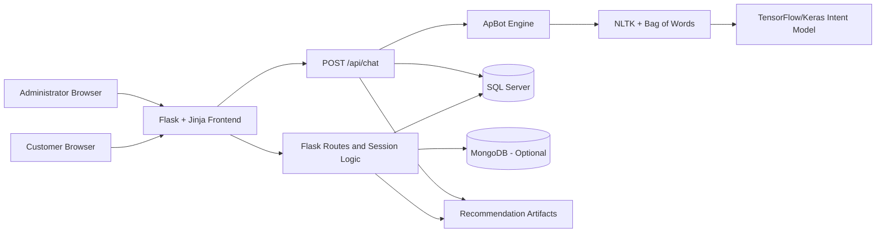

# ZiloCart — E-Commerce Recommendation System with ApBot

ZiloCart is a full-stack Flask e-commerce application that combines a responsive shopping experience, an AI/ML customer assistant named **ApBot**, product recommendation features, SQL Server commerce data, optional MongoDB activity logging, customer accounts, checkout, reviews, and role-protected administration.

ApBot is the primary conversational AI component required by the supplied SRS. It uses **NLTK preprocessing**, a binary **Bag-of-Words** representation, and a trained **TensorFlow/Keras intent classifier** exposed through a Flask REST endpoint. Recommendation models are integrated as supporting product-discovery features.

> **Repository:** [MHamza-9111/E-Commerce-Product-Recommendation-System](https://github.com/MHamza-9111/E-Commerce-Product-Recommendation-System)
---

## Contents

- [Project Overview](#project-overview)
- [Main Features](#main-features)
- [System Architecture](#system-architecture)
- [ApBot Chatbot](#apbot-chatbot)
- [Recommendation Features](#recommendation-features)
- [Technology Stack](#technology-stack)
- [Database Design](#database-design)
- [Project Structure](#project-structure)
- [Installation](#installation)
- [Running the Application](#running-the-application)
- [Demo Accounts](#demo-accounts)
- [Using ApBot](#using-apbot)
- [Notebooks and Model Artifacts](#notebooks-and-model-artifacts)
- [Testing Checklist](#testing-checklist)
- [Troubleshooting](#troubleshooting)
- [Security and Production Notes](#security-and-production-notes)
- [Assumptions and Limitations](#assumptions-and-limitations)

---

## Project Overview

The project addresses two common e-commerce problems:

1. Customers need fast, natural assistance while browsing products, offers, orders, delivery, returns, and checkout.
2. Large product catalogs can make discovery difficult, especially for new or undecided customers.

ZiloCart therefore combines:

- a conventional e-commerce workflow;
- the ApBot intent-classification chatbot;
- live catalog and signed-in customer context for chatbot responses;
- content-based, collaborative, hybrid, and trending product discovery;
- a seasonal Azaadi Sale with product-specific discounts; and
- administration and reporting tools.

The Flask application is the integration layer. It renders Jinja templates, manages customer sessions, communicates with SQL Server, optionally logs activity to MongoDB, loads recommendation artifacts, calls the ApBot engine, and exposes the `/api/chat` JSON endpoint.

---

## Main Features

### Customer Experience

- Responsive ZiloCart storefront for desktop and mobile browsers
- Product catalog with keyword search, category, brand, price, rating, and sort controls
- Detailed product pages with image galleries, stock, ratings, descriptions, and similar products
- User registration, login, logout, profile editing, profile-image upload, and password change
- Token-based password-reset demonstration flow
- Session shopping cart with quantity updates, removal, clearing, and live stock checks
- Checkout with delivery address, phone number, order creation, and stock decrement
- Customer order history and order-status visibility
- Purchase-verified reviews, limited to one review per user/product pair
- Product and profile image uploads up to 5 MB
- Graceful 404 and oversized-upload handling

### ApBot Customer Assistant

- Compact welcome message without forcing the full chatbot window open
- Movable desktop chatbot window with saved browser position
- Responsive chat interface, typing indicator, quick actions, and keyboard support
- Intent classification for 21 e-commerce conversation categories
- Live product cards with image, description, brand/category, rating, stock, and price
- Sale-aware cards with original price, discount, and sale price
- Product search using category, useful keywords, and budget expressions
- Logged-in cart, latest-order, checkout, and account context
- Professional fallback for irrelevant or unsupported questions
- Customer-facing interface hides raw intent names and confidence scores
- Privacy boundary: ApBot can use only the active customer's own account, cart, and order context

### Seasonal Promotion

- Azaadi Sale automatically becomes active during August
- Different discounts are assigned to selected products
- Sale prices are used consistently in product cards, cart, checkout, and saved order items
- ApBot can explain active offers and display sale products

### Administration

- Admin-only dashboard and navigation
- Product creation, editing, image management, and deletion
- Order listing, status filtering, and status updates
- Customer status management, including ban/unban and deletion controls
- Review moderation and bulk review removal
- Reports for sales, categories, products, and customer activity

---

## System Architecture



### Runtime Flow

1. A browser sends a page request, commerce action, or ApBot message.
2. Flask validates the request and reads the active session.
3. Commerce data is read from or written to SQL Server.
4. Optional activity events are written to MongoDB.
5. Recommendation artifacts provide product-discovery signals when available.
6. For chat messages, ApBot converts text to a Bag-of-Words vector and predicts an intent.
7. Flask safely enriches selected intents with live products or the active customer's own context.
8. Jinja/JavaScript displays the result to the customer.

---

## ApBot Chatbot

### Dataset

The file [`chatbot/intents.json`](chatbot/intents.json) contains:

- **21 intent classes**
- **1,065 conversational patterns**
- multiple approved responses per intent

Implemented intent tags:

```text
greeting, goodbye, thanks, help, product_search, recommendation,
product_details, similar_products, offers, order_tracking, checkout,
payment, returns, contact_support, cancel_order, shipping, cart,
wishlist, product_comparison, account, unknown
```

### NLP and Classification Pipeline

```text
Customer message
    -> lowercase and wordpunct_tokenize
    -> alphabetic-token filtering
    -> Porter stemming
    -> binary Bag-of-Words vector
    -> TensorFlow/Keras softmax classifier
    -> predicted intent and confidence
    -> response selected from intents.json
    -> optional live product/account/cart/order enrichment
    -> JSON response returned to the website
```

The runtime confidence threshold in [`chatbot/engine.py`](chatbot/engine.py) is `0.45`. Predictions below that threshold are mapped to the `unknown` intent.

### Model Architecture

The training notebook defines a dense intent classifier with:

- binary Bag-of-Words input;
- Dense 64 with ReLU;
- Dropout 0.30;
- Dense 32 with ReLU;
- a 21-class softmax output;
- sparse categorical cross-entropy;
- Adam optimisation; and
- validation-loss early stopping with best-weight restoration.

The project documentation records a representative run of approximately **99.41% best training accuracy** and **85.92% best validation accuracy**. Validation accuracy is the more useful indicator for unseen examples; conversation-level testing is still required.

### Chatbot Runtime Files

| File | Purpose |
|---|---|
| `chatbot/intents.json` | Intent tags, patterns, and approved responses |
| `chatbot/Chatbot_Training.ipynb` | Dataset preparation, vectorisation, training, and evaluation |
| `chatbot/engine.py` | Runtime preprocessing, inference, confidence threshold, and response selection |
| `chatbot/chatbot_model.keras` | Saved TensorFlow/Keras classifier |
| `chatbot/words.pkl` | Saved vocabulary in model-input order |
| `chatbot/classes.pkl` | Saved intent classes in model-output order |
### REST API

**Endpoint**

```http
POST /api/chat
Content-Type: application/json
```

**Example request**

```json
{
  "message": "Show me phones under 50000"
}
```

**Representative response shape**

```json
{
  "reply": "Here are the closest matches from the live catalog.",
  "intent": "product_search",
  "confidence": 0.97,
  "products": [
    {
      "id": 1,
      "name": "Example product",
      "brand": "Example brand",
      "category": "Electronics",
      "price": 49999.0,
      "original_price": 54999.0,
      "discount_percent": 9,
      "sale_name": "Azaadi Sale",
      "rating": 4.5,
      "stock": 10,
      "description": "Short product description",
      "image_url": "/static/products/example.jpg",
      "url": "/product/1"
    }
  ]
}
```

The API includes intent/confidence for evaluation and backend decisions. The normal customer interface deliberately does not display those technical fields.

Input rules:

- an empty message returns HTTP `400`;
- messages longer than 500 characters return HTTP `400`; and
- valid requests return a JSON reply and optional product cards.

### Safe Customer Context

ApBot may access:

- public product and sale information;
- the current session cart;
- the signed-in customer's latest order; and
- the signed-in customer's own name/email for account guidance.

ApBot must not list, search, or expose another customer's private records. Admin data remains protected by role checks and is not returned through the customer chatbot.

---

## Recommendation Features

Recommendation models are supporting enhancements that improve product discovery alongside ApBot.

### Content-Based

- Uses product text/features and a KNN model
- The saved matrix combines reduced text features with normalised numerical information
- Suggests similar products on product-detail pages
- Falls back to same-category/brand SQL results when artifacts are unavailable

### Collaborative

- Uses a user-item purchase matrix and user-neighbour KNN
- Excludes products the active customer already purchased
- Ranks products using related users' purchase quantities and similarity
- Falls back to popular/trending items for unknown or cold-start users

### Hybrid Homepage Discovery

- Combines available collaborative suggestions, recently viewed-product content suggestions, and trending fill
- Uses deduplication so a product is not displayed twice
- Handles missing model files or missing activity history gracefully

### Trending

- Uses recent MongoDB activity when MongoDB is available
- Falls back to highly rated SQL Server products when MongoDB is unavailable

### Recommendation Artifacts

```text
vectorizer.pkl
svd.pkl
feature_scaler.pkl
numeric_weight.pkl
knn_content.pkl
tfidf_matrix.pkl
product_ids.pkl
knn_users.pkl
user_item_matrix.pkl
hybrid_weights.pkl
```

These files are loaded at application startup. A missing or incompatible recommendation artifact produces a warning and uses a fallback; the ApBot model files are required for importing the current application.

---

## Technology Stack

| Layer | Technologies |
|---|---|
| Backend | Python 3.12, Flask 3, Jinja2 |
| Frontend | HTML5, CSS3, Bootstrap 5, JavaScript |
| Chatbot NLP | NLTK tokenisation, PorterStemmer, Bag of Words |
| Chatbot ML | TensorFlow/Keras, NumPy |
| Recommendations | scikit-learn, pandas, SciPy, joblib/pickle |
| Primary database | Microsoft SQL Server via `pyodbc` |
| Optional activity store | MongoDB via `pymongo` |
| Notebooks | JupyterLab, ipykernel, matplotlib, seaborn |
| Configuration | `python-dotenv` and `.env` |
| Image handling | Pillow and Werkzeug secure filenames |

---

## Database Design

The SQL Server script [`EcommerceDB.sql`](EcommerceDB.sql) creates and seeds:

| Entity | Responsibility |
|---|---|
| `Users` | Customer/admin account, password hash, role, status, reset token, profile image |
| `Products` | Product details, price, category, brand, rating, stock, and image fields |
| `Orders` | Customer order, date, delivery details, total, and status |
| `OrderItems` | Products, quantities, and purchase prices saved for each order |
| `Reviews` | Purchase-verified rating/comment linked to a user and product |

Important behavior:

- user email is unique;
- the `(user_id, product_id)` review pair is unique;
- cart data remains in the signed Flask session until checkout;
- checkout writes `Orders` and `OrderItems` in SQL Server; and
- MongoDB is optional and stores activity documents in `ecommerce_logs.activities`.

`EcommerceDB.sql` is UTF-16 encoded. Open it in SQL Server Management Studio; if another editor displays unreadable characters, select UTF-16 or convert a copy to UTF-8.

---

## Project Structure

```text
E-Commerce-Product-Recommendation-System/
├── app.py                         # Flask routes, commerce logic, ApBot API, admin tools
├── EcommerceDB.sql                # SQL Server schema and seed data
├── Main_Data_Pipeline.ipynb       # Recommendation data/model notebook
├── requirements-app.txt           # Web app, databases, recommendations, and ApBot runtime
├── requirements-notebook.txt      # Additional Jupyter/visualisation packages
├── README.md                       # Detailed GitHub repository guide
├── chatbot/
│   ├── intents.json               # 21 intents and 1,065 patterns
│   ├── Chatbot_Training.ipynb     # ApBot training workflow
│   ├── engine.py                  # ApBot runtime engine
│   ├── chatbot_model.keras        # Trained intent model
│   ├── words.pkl                  # Saved vocabulary
│   └── classes.pkl                # Saved class labels
├── templates/
│   ├── _chatbot_widget.html       # ApBot HTML widget
│   ├── _components.html           # Reusable storefront components
│   ├── _icon_sprite.html          # Shared SVG icon definitions
│   ├── base.html                  # Shared layout/navigation
│   ├── index.html                 # Homepage
│   ├── products.html              # Searchable/filterable catalog
│   ├── product_detail.html        # Product details, reviews, similar products
│   ├── cart.html                  # Shopping cart
│   ├── checkout.html              # Delivery and order placement
│   ├── order_history.html         # Customer orders
│   ├── profile.html               # Customer profile management
│   └── admin/                     # Dashboard, products, orders, users, reviews, reports
├── static/
│   ├── chatbot.css / chatbot.js   # ApBot interface and REST client
│   ├── storefront.css / storefront.js
│   ├── logo.png
│   ├── products/                  # Bundled product images
│   └── uploads/                   # Runtime profile/product uploads
└── *.pkl                          # Saved recommendation artifacts
```

---

## Installation

### Prerequisites

Install the following before running the project:

- Python **3.12**
- [`uv`](https://docs.astral.sh/uv/) (recommended) or `pip`
- Microsoft SQL Server
- SQL Server Management Studio or another SQL client
- Microsoft ODBC Driver 17 or 18 for SQL Server
- MongoDB only if activity-based trending/logging is required
- Git

### 1. Clone the Repository

```bash
git clone https://github.com/MHamza-9111/E-Commerce-Product-Recommendation-System.git
cd E-Commerce-Product-Recommendation-System
```

### 2. Create and Activate the Virtual Environment

Recommended `uv` workflow:

```bash
uv venv --python 3.12 .venv
```

Windows PowerShell:

```powershell
.\.venv\Scripts\Activate.ps1
```

Windows Command Prompt:

```bat
.venv\Scripts\activate.bat
```

Linux/macOS:

```bash
source .venv/bin/activate
```

### 3. Install Application Dependencies

```bash
uv pip install -r requirements-app.txt
```

Equivalent `pip` command:

```bash
python -m pip install -r requirements-app.txt
```

For notebook work, first install the application requirements and then the additional notebook packages:

```bash
uv pip install -r requirements-notebook.txt
```

### 4. Create the SQL Server Database

1. Open SQL Server Management Studio.
2. Connect to the local SQL Server instance.
3. Open `EcommerceDB.sql` using UTF-16 encoding.
4. Execute the complete script.
5. Confirm that the `EcommerceDB` database contains `Users`, `Products`, `Orders`, `OrderItems`, and `Reviews`.

### 5. Configure `.env`

Create a `.env` file in the repository root:

```env
SECRET_KEY=replace-with-a-long-random-secret
SQLSERVER_CONNECTION_STRING=DRIVER={ODBC Driver 17 for SQL Server};SERVER=localhost;DATABASE=EcommerceDB;Trusted_Connection=yes;Encrypt=no;TrustServerCertificate=yes;
MONGODB_URI=mongodb://localhost:27017/
FLASK_DEBUG=1
```

Notes:

- Change `SERVER=localhost` if SQL Server uses a named instance, for example `SERVER=localhost\SQLEXPRESS`.
- Change the driver name to `ODBC Driver 18 for SQL Server` when Driver 18 is installed.
- `MONGODB_URI` is optional; the application continues with SQL-based fallbacks when MongoDB is unavailable.
- Never commit `.env`; it is already ignored by Git.

### 6. Optional: Start MongoDB

```bash
mongod
```

If MongoDB is not installed or running, startup continues and recommendation/trending functions use available SQL fallbacks.

---

## Running the Application

With the environment active:

```bash
python app.py
```

Open:

- Storefront: <http://127.0.0.1:5000/>
- Product catalog: <http://127.0.0.1:5000/products>
- Admin dashboard after admin login: <http://127.0.0.1:5000/admin>

To disable Flask debug mode:

```env
FLASK_DEBUG=0
```

The application loads the ApBot TensorFlow model and recommendation artifacts during startup, so the first launch may take longer than an ordinary Flask project.

---

## Demo Accounts

The seeded SQL script includes these local demonstration accounts:

| Purpose | Email | Password | State |
|---|---|---|---|
| Administrator | `admin@smartshop.com` | `admin123` | Active admin |
| General customer demo | `demo@test.com` | `test123` | Active customer |
| Customer/order demo | `usman@test.com` | `test123` | Active customer |
| Customer demo | `fatima@test.com` | `test123` | Active customer |
| Customer demo | `kamran@test.com` | `test123` | Active customer |
| Banned-account behavior | `sara@test.com` | `test123` | Initially banned |

These credentials are seed data for local assessment only. Change or remove them before any public deployment.

---

## Using ApBot

1. Open any customer-facing page.
2. A compact welcome message appears near the ApBot launcher; the full chatbot does not open automatically.
3. Click the launcher or welcome message.
4. Enter a natural e-commerce question or use a quick action.
5. Drag the chat header to reposition the window on desktop; double-click the header to reset its position.

Suggested demonstrations:

```text
Hi
Show me phones under 50000
Tell me about laptops
Show similar products
What offers are available?
What is in my cart?
Where is my order?
Take me to checkout
How do returns work?
I need customer support
What is the weather?
```

The last question should receive the professional out-of-scope response rather than an unrelated shopping answer.

---

## Notebooks and Model Artifacts

### ApBot Training Notebook

```bash
jupyter lab chatbot/Chatbot_Training.ipynb
```

The notebook prepares the intent dataset, creates the Bag-of-Words features, trains/evaluates the Keras classifier, and saves the chatbot artifacts. Keep `words.pkl`, `classes.pkl`, and `chatbot_model.keras` from the same training run; mixing artifacts from different runs can produce incorrect predictions or shape errors.

### Recommendation Notebook

```bash
jupyter lab Main_Data_Pipeline.ipynb
```

`Main_Data_Pipeline.ipynb` contains a hardcoded `SERVER=MHAMZA` connection reference. Update that notebook cell to the evaluator's SQL Server instance before rerunning the recommendation pipeline.

Retraining may overwrite root-level recommendation `.pkl` files. Back up working artifacts before experimenting.

---

## Testing Checklist

### Static Validation

```bash
python -m py_compile app.py chatbot/engine.py
```

### ApBot Acceptance

- Greeting returns a natural welcome
- Product and budget request returns relevant product cards
- Product-detail and similar-product prompts return useful guidance
- Offers prompt returns active sale information in August
- Empty JSON message returns HTTP 400
- Message longer than 500 characters returns HTTP 400
- Irrelevant topic returns the professional shopping-scope response
- Customer UI does not display intent names or confidence scores
- Signed-out order/account request asks the customer to sign in
- Signed-in order/account request uses only the active customer's own data

### Commerce Regression

- Registration and login work for active customers
- Banned customer cannot continue using an authenticated session
- Product search and filters return expected results
- Cart quantity cannot exceed available stock
- Sale price remains consistent through cart and checkout
- Checkout writes one order and its order items
- Purchase-verified customer can leave one review per product
- Admin routes reject non-admin users
- Admin can update order status and moderate products/users/reviews

### Optional-Service Test

Stop MongoDB and start the Flask application. Core SQL-backed storefront and ApBot behavior should continue; activity/trending functions should use their fallbacks.

---

## Troubleshooting

### `ModuleNotFoundError`

Confirm the virtual environment is active and reinstall:

```bash
uv pip install -r requirements-app.txt
```

### SQL Server driver not found

List installed drivers in Python:

```python
import pyodbc
print(pyodbc.drivers())
```

Update `SQLSERVER_CONNECTION_STRING` so the driver name exactly matches an installed ODBC driver.

### SQL login or connection failure

- Confirm SQL Server is running.
- Confirm `EcommerceDB` exists.
- Check the server/instance name.
- Check Windows Authentication or provide SQL credentials in the connection string.
- Confirm TCP/IP and certificate settings when connecting remotely.

### TensorFlow or model-loading failure

- Use Python 3.12 with the versions in `requirements-app.txt`.
- Confirm all files under `chatbot/` are present.
- Do not mix model, vocabulary, and class files from different training runs.
- Reinstall NumPy/TensorFlow if saved artifacts were created under incompatible versions.

### Recommendation warning at startup

A missing/incompatible recommendation `.pkl` file triggers a warning and fallback. Reinstall the pinned dependencies or rerun `Main_Data_Pipeline.ipynb` against the correct database.

### MongoDB warning or no trending activity

MongoDB is optional. Start `mongod` and verify `MONGODB_URI` only when activity-backed trending/logging is required.

### Password reset does not send an email

The current academic demonstration creates a one-hour token and displays the reset URL locally. Configure an SMTP/email provider before production deployment.

---

## Security and Production Notes

Before deploying publicly:

- set a long random `SECRET_KEY`;
- set `FLASK_DEBUG=0`;
- remove or change all seeded demo credentials;
- serve behind HTTPS and a production WSGI server;
- add CSRF protection to state-changing forms;
- configure secure cookie settings and deployment headers;
- configure a real email provider for password reset;
- validate and scan uploaded files;
- restrict database permissions;
- add rate limiting to authentication and chatbot endpoints;
- use structured logging and monitoring; and
- back up SQL Server and uploaded files.

The included Flask development server is for local assessment, not production traffic.

---

## Assumptions and Limitations

- The project is designed for a local academic/demo environment.
- SQL Server is required for the integrated application.
- MongoDB is optional.
- Checkout currently uses the implemented demonstration payment workflow rather than a live card/wallet gateway.
- Password-reset email delivery is not configured; the local reset URL is displayed for demonstration.
- ApBot is an intent classifier, not a general-purpose or generative assistant.
- ApBot accuracy depends on the quality and coverage of `intents.json`.
- The classifier handles one message at a time; website session context is added by Flask.
- Recommendation quality depends on available product, order, and activity history.
- Recommendation artifacts can fall back to SQL/trending behavior when unavailable.
- The Azaadi Sale is active only during August according to the server date.
- Large production datasets would require pagination, caching, background jobs, and broader performance testing.
